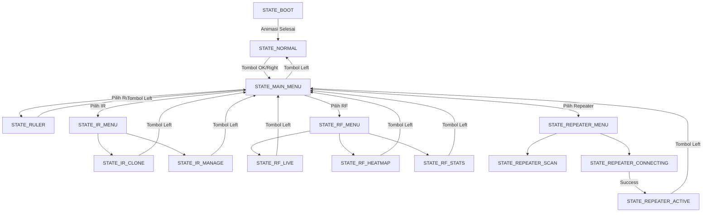

# State Machine Diagram - Gadget V1 🗺️

Berikut adalah alur transisi kondisi (State) dalam firmware Gadget V1.

---

## 🎨 Diagram Alur Utama

---

## 📋 Daftar State Detail

| State | Modul | Deskripsi |
| :--- | :--- | :--- |
| **STATE_BOOT** | Display | Menampilkan logo Gadget V1 saat startup. |
| **STATE_NORMAL** | Sensor | Dashboard utama (Suhu, Jarak, dsb). |
| **STATE_MAIN_MENU** | UI | Navigasi vertikal 5 modul utama. |
| **STATE_IR_CLONE** | IR | Menunggu sinyal IR untuk diduplikasi. |
| **STATE_RF_LIVE** | RF | Grafik PPS (Packet Per Second) real-time. |
| **STATE_REPEATER_ACTIVE**| WiFi | Monitoring trafik NAPT yang sedang berjalan. |

*Untuk penjelasan lifecycle, lihat [ARCHITECTURE.md](./ARCHITECTURE.md)*
